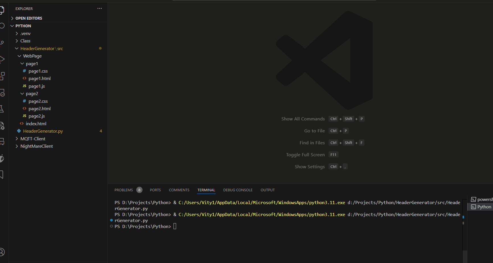

# WebpageHeaderGenerator
This is a simple Python script that generates C header files from all files in a directory. Itsimplifies the development and deployment of static websites served by microcontrollers by allowing users to create sites using CSS, JavaScript, and HTML in an editor, with all the advantages of an IDE. It then automatically converts the code into const char* so microcontrollers can serve the sites.

## Usage:
The user must ~hardcoded for now~ set the `WebPageFolder` to the desired source folder. By default, it is set to `$PROJECT_DIR\src\WebPage\` on platform io environments or `./WebPage/` elsewhere.\
The user must also set the output folder `DEST_DIR` to the desired destination folder. By default, it is set to `$PROJECT_DIR\src\WebPage\Output`\
A file ```Output/webfiles.h``` will be created importing all the files generated. So we can just include one file.




### Plataformio:
If you are using Plataformio. you can add this script to the `extra_scripts` with the `pre:` prefix, that way it will run on every build.
on `plataformio.ini`:
```Plataformio
[env:esp32]
platform = espressif32
framework = arduino
board = esp32dev
monitor_speed = 115200
monitor_filters = send_on_enter, esp32_exception_decoder
extra_scripts = pre:src/Webpage/HeaderGenerator.py
```
In this configuration, the files inside the source folder will be updated every build and you can edit the JS, CSS, HTML files normally ~on vscode~ and not inside c/c++.


## Running the script:
To run the script simply edit ```WebFolderPage``` to target the desired folder and run the script.
If you are running it on a plataformio environment, the default folder will be `````` 


You can set variables in the files handled by the script in the format ```{value}``` and set ```USE_STATIC_CONSTANTS = true``` to replace such values with constants from your code.
They need to be in the format:
```C++ 
#define {value} "{target}"
```

If those conditions are met, the script will replace all instances of ```{value}``` with the value defined by the target. You will also need to tell which file contain such definitions that are to be used


## Generating the .h files
To generate the files call:
```Python
gen_headers(src_dir, dest_dir, tree = 0):
```
It was already done by the script.
This takes in a source directory, a destination directory, and a tree value ~which is not used yet~.\
for each file in the source directory that is not a Python file, generates a header file in the destination directory.\
If a header file already exists it will be deleted before creating a new one/\ 
Also saves the name of the files generated to a variable `saved_files_names`.\
It returns without doing anything if the source directory is the output directory or the source directory does not exists.
The Header will contain a `const char*` that is named the same as the file (replacing the dot with an underscore) and will be equal to a literal raw with the content of the file.\
Returns nothing.\

### Example:

If there is a file `myWebPage.html` in the source directory contains:
```html
<!DOCTYPE html>
<html>

<body>
    <h1>Hello World!</h1>
</body>

</html>
```
After running this script, The file `myWebPage.h` will be created at the destination directory containing:
```C++
const char *myWebPage_html = R"==(<!DOCTYPE html>
<html>

<body>
    <h1>Hello World!</h1>
</body>

</html>)==";
```
If the flag `USE_STATIC_CONSTANTS` is set to True, will search every word inside braces of each file in all files defined in `FILES_WITH_STATIC_CONSTANTS` using ```getValueFromFile(files, value)```.\
If the flag `INCLUDE_SUBFOLDERS` is set to True, all files inside subfolders of the source directory will have a header file created.

## Generating outer 
```Python
gen_headers_super(saved_files_names,dest_dir):
```
Takes a list of file names and a destination directory
This method will create a file `webfiles.h` in the destination folder. `webfiles,h` will just include all files in the list of file name. This is done so that one can now include only "webpage.h" on your project and have all the definitions of each file generated.

